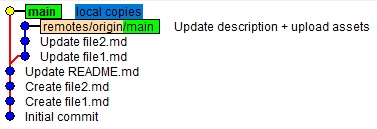
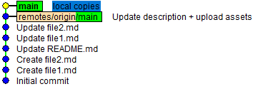
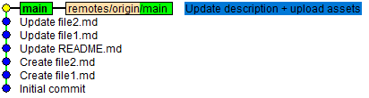

How to solve conflicts while doing `git pull --rebase`
======================================================

This tutorial will guide you through a bunch of simple steps that will
help you resolve conflicts that may arise when trying to pull from 
a Git upstream repository.

### 0. Create the local context responsible for generating conflicts
Open a shell and type:
```sh
$ git clone https://github.com/icub-tech-iit/how-to-solve-pull-rebase-conflicts.git
$ cd how-to-solve-pull-rebase-conflicts.git
(main) $ git reset --hard 6b21762
(main) $ echo "This is the \`local\` copy of the file." > file1.md
(main) $ echo "This is the \`local\` copy of the file." > file2.md
(main) $ git commit -am "local copies"
```

This will bring up the following history showing how the local `main` branch has
just diverged (by design) with respect to the upstream `main` branch.



Essentially, we have modified 2 files, namely `file1.md` and `file2.md`, with
some local changes that we have finally committed.

### 1. Try to `git pull --rebase`
Before pushing our changes, it's a good rule to let our local repo include the
latest modifications happened upstream. To this end, we do:

```sh
(main) $ git pull --rebase
...
CONFLICT (content): Merge conflict in file2.md
Auto-merging file1.md
CONFLICT (content): Merge conflict in file1.md
(main|REBASE 1/1) $
```

Unfortunately, conflicts arised during rebasing (as expected).
We can thus explore what files are affected by those conflicts:

```sh
(main|REBASE 1/1) $ git status
...
Unmerged paths:
  (use "git restore --staged <file>..." to unstage)
  (use "git add <file>..." to mark resolution)
        both modified:   file1.md
        both modified:   file2.md
...
(main|REBASE 1/1) $
```

Let's undo this operation:

```sh
(main|REBASE 1/1) $ git rebase --abort
(main) $
```

This way, we've rolled back to the situation in place ahead of the command `git pull --rebase`.

### 2a. Resolving conflicts at `git pull --rebase` time.
We can now proceed by either keeping our changes with the option `-X theirs` or discarding the
local modifications to get fully aligned with upstream with the option `-X ours`.

To keep our changes, do:
```sh
(main) $ git pull --rebase -X theirs
Successfully rebased and updated refs/heads/main.
```

As a result, the files will contain our local changes:
```sh
(main) $ cat file1.md
This is the `local` copy of the file.
(main) $ cat file2.md
This is the `local` copy of the file.
```

This will bring up the following history:



:sparkles: The history is linear and our topmost commit is ready to be pushed upstream!

To discard local modifications instead, do:
```sh
(main) $ git pull --rebase -X ours
dropping 06a52b5244a1be61431a2d7e25ff33fa4e91b6f2 local copies -- patch contents already upstream
Successfully rebased and updated refs/heads/main.
```

This will bring up the following history:



From the upstream standpoint, the history remains unvaried as nothing has happened in the meantime.
Our local changes have been discarded on purpose.

As a result, the files will sport the original content:
```sh
(main) $ cat file1.md
This is the `upstream` copy of the file.
(main) $ cat file2.md
This is the `upstream` copy of the file.
```

:warning: Curiously, the logic underlying the options `ours` and `theirs` seems somehow swapped :thinking:

You can find out the rationale by perusing this [resource](https://howchoo.com/git/git-merge-conflicts-rebase-ours-theirs#using-ours-theirs-during-a-rebase).

### 2b. Resolving conflicts file by file
The easiest way is certainly to do the following:
1. Save temporarily our local changes somewhere, e.g. in `/tmp`.
1. Proceed with `git pull --rebase -X ours` to resolve conflicts and grab the latest modifications from upstream.
1. Overwrite in the repo only those files we would like to update by pivoting on `/tmp`. 
1. Conclude with `git add/commit/push`.

Nonetheless, we can apply the intended Git procedure by resorting to the command `git checkout --ours/theirs`
to select the version of the single file we aim to keep.

Remember: `--ours` to favor upstream and `--theirs` to favor local changes.

Here's below a typical workflow that lets you select the upstream version for `file1.md` and the local version for `file2.md`.
This time, instead of aborting the rebase, we will continue to resolve the conflicts within the proposed git interface.
```sh
(main) $ git pull --rebase
(main|REBASE 1/1) git status
(main|REBASE 1/1) git checkout --ours file1.md
(main|REBASE 1/1) git checkout --theirs file2.md
(main|REBASE 1/1) git add .
(main|REBASE 1/1) git rebase --continue
(main) $ cat file1.md
This is the `upstream` copy of the file.
(main) $ cat file2.md
This is the `local` copy of the file.
```
